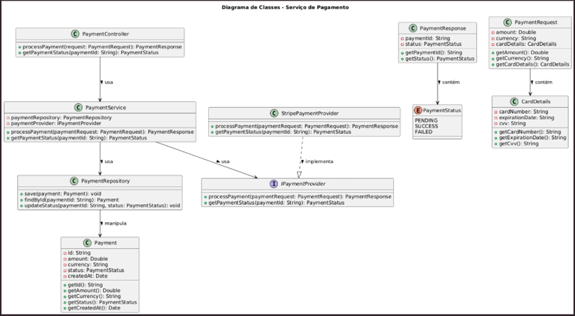

# Turma: Brasil 2023

**Autores:**  

- Arthur David Müzel Calciolari  
- Iliê Soares  
- Matheus Castilho  
- Luann Lucas

---

# PROJETO FINAL

_Trabalho realizado para a matéria de arquitetura de software, tendo como orientador(a) André Braga e tutor(a) Fernando Assis._

_JALA UNIVERSITY_  
2025

---

# Sumário


- [Turma: Brasil 2023](#turma-brasil-2023)
- [PROJETO FINAL](#projeto-final)
- [Sumário](#sumário)
- [Características Arquitetônicas](#características-arquitetônicas)
  - [Justificativas](#justificativas)
- [Estilo Arquitetônico Selecionado](#estilo-arquitetônico-selecionado)
- [Diagrmas C4 (até o nível 3 para componentes críticos)](#diagrmas-c4-até-o-nível-3-para-componentes-críticos)
  - [Nível 1: Diagrama de Contexto](#nível-1-diagrama-de-contexto)
    - [Descrição do Diagrama](#descrição-do-diagrama)
  - [Nível 2: Diagrama de Containers](#nível-2-diagrama-de-containers)
    - [Descrição do Diagrama](#descrição-do-diagrama-1)
  - [Nível 3: Diagrama de Componentes (exemplo para o Serviço de Pedidos)](#nível-3-diagrama-de-componentes-exemplo-para-o-serviço-de-pedidos)
    - [Descrição do Diagrama](#descrição-do-diagrama-2)
- [Repositório com a organização do código](#repositório-com-a-organização-do-código)
  - [Observações](#observações)
- [Diagrama de Classe de um Componente](#diagrama-de-classe-de-um-componente)
  - [Exemplo: Serviço de Pagamento](#exemplo-serviço-de-pagamento)
    - [Descrição do Diagrama](#descrição-do-diagrama-3)
- [Distância em relação à sequência principal](#distância-em-relação-à-sequência-principal)

---

# Características Arquitetônicas

Suponhamos que definimos as seguintes características arquitetônicas (ou *architectural drivers*) para o nosso sistema de E-commerce:

- **Disponibilidade**
- **Escalabilidade**
- **Segurança**
- **Desempenho**
- **Manutenibilidade**
- **Observabilidade**

A seguir, uma tabela de priorização simples (pontuação de 1 a 5):

|  Característica  | Prioridade (1-5) | Justificativa                                                                                                 |
| :--------------: | :--------------: | ------------------------------------------------------------------------------------------------------------- |
| Disponibilidade  |        5         | Em um sistema de E-commerce, ficar fora do ar significa perda imediata de vendas e receita.                   |
|  Escalabilidade  |        5         | Eventos sazonais (Black Friday, Dia das Mães etc.) exigem capacidade de suportar picos de acesso.             |
|    Segurança     |        4         | Transações financeiras e dados sensíveis de clientes exigem controles de segurança elevados.                  |
|    Desempenho    |        4         | Resposta rápida é crucial para boa experiência de usuário, afetando a taxa de conversão.                      |
| Manutenibilidade |        3         | Alterações frequentes (novas features, promoções, integrações) devem ser aplicadas com rapidez e baixo risco. |
| Observabilidade  |        3         | Monitoramento e logging são importantes para diagnosticar e corrigir problemas em produção.                   |

## Justificativas

- **Disponibilidade:**  
  Cada minuto fora do ar gera prejuízos financeiros e prejudica a reputação da marca. Prioridade máxima, com redundância e mecanismos de *failover*.

- **Escalabilidade:**  
  Datas especiais (Black Friday, Natal, etc.) podem aumentar drasticamente o volume de acessos e transações, exigindo escalabilidade horizontal ou vertical.

- **Segurança:**  
  Devido ao manuseio de dados de pagamento e informações pessoais, são necessários mecanismos de criptografia, políticas de acesso e conformidade com legislações (LGPD, PCI-DSS).

- **Desempenho:**  
  Páginas lentas afugentam clientes. Otimizar a velocidade de carregamento e reduzir a latência é fundamental.

- **Manutenibilidade:**  
  Facilitar a evolução do sistema e correção de defeitos sem impactos em outras partes, reduzindo o *time to market*.

- **Observabilidade:**  
  Uso de métricas, logs estruturados e rastreamento distribuído para identificar gargalos e incidentes rapidamente.

---

# Estilo Arquitetônico Selecionado

Vamos comparar duas alternativas: **Arquitetura em Camadas (Monolito Estratificado)** vs. **Microserviços**.

| Característica       | Microserviços                                                                               | Camadas (Monolito)                                                                                     |
| -------------------- | ------------------------------------------------------------------------------------------- | ------------------------------------------------------------------------------------------------------ |
| **Disponibilidade**  | Alta, pois falhas em um serviço não necessariamente derrubam o sistema (com boas práticas). | Se o monolito cair, o sistema inteiro fica indisponível, salvo em casos de réplica ativa/passiva.      |
| **Escalabilidade**   | Cada serviço pode escalar independentemente.                                                | Escalabilidade “tudo ou nada”: o monolito inteiro deve ser escalado, elevando possivelmente os custos. |
| **Segurança**        | Abordagem granular, mas requer mais governança e observabilidade.                           | Implementação mais simples, com autenticação e controle centralizado.                                  |
| **Desempenho**       | Pode haver sobrecarga de comunicação entre serviços, mas escala bem horizontalmente.        | Geralmente rápido em comunicação interna, mas pode se tornar pesado com o crescimento.                 |
| **Manutenibilidade** | Facilita manutenção com times pequenos dedicados, porém exige padronização e automação.     | Inicialmente simples, mas pode ficar complexa à medida que o código cresce.                            |
| **Observabilidade**  | Necessita de observabilidade distribuída (logs, métricas, tracing).                         | Mais simples de instrumentar em um único processo, mas pode complicar com sistemas maiores.            |

**Decisão:**  
Dada a alta necessidade de disponibilidade e escalabilidade, optamos por **Microserviços**. Apesar do overhead inicial em implementação e DevOps (CI/CD, observabilidade), esta abordagem oferece flexibilidade, escalabilidade horizontal e tolerância a falhas em partes isoladas.

---

# Diagrmas C4 (até o nível 3 para componentes críticos)

A Representação C4 ajuda a comunicar de forma clara a arquitetura. A seguir, são descritos os níveis com espaços para diagramas.

## Nível 1: Diagrama de Contexto

**Descrição:**  
Visão geral do Sistema de E-commerce, destacando conexões com usuários e sistemas externos:

- **Sistema de E-commerce**
- **Atores Externos:**  
  - Usuário (Cliente)  
  - Admin da Loja  
  - Provedores de Pagamento  
  - Transportadoras  
- **Interações:**  
  - Cliente: navega, adiciona produtos e efetua pagamentos.  
  - Admin: cadastra produtos e acessa relatórios de venda.  
  - Transportadoras e Provedores de Pagamento: processam entregas e transações.

**Imagem do Diagrama de Contexto:**  


### Descrição do Diagrama

- O `nosso Diagrama C1` exemplifica a visão geral do Sistema de E-commerce, destacando suas conexões com usuários e sistemas externos. Ele apresenta **dois principais atores humanos**: o Cliente, que interage com a plataforma para navegar em produtos, fazer compras e realizar pagamentos, e o Admin da Loja, responsável por gerenciar o catálogo de produtos e acessar relatórios de vendas. Além disso, a Plataforma de E-commerce atua como um orquestrador central, integrando diferentes serviços e garantindo que as operações de venda, pagamento e entrega ocorram de forma eficiente.
- Os **sistemas externos desempenham papéis essenciais para a funcionalidade da plataforma**. O Provedor de Pagamento processa transações financeiras, enquanto a Transportadora recebe informações sobre os pedidos e atualiza o status da entrega. O Sistema Legado (ERP/CRM) garante a sincronização de estoques e dados dos clientes, e o Sistema de Monitoramento coleta métricas e logs para análise de desempenho e falhas. A CDN (Content Delivery Network) contribui para a escalabilidade, distribuindo recursos estáticos como imagens e arquivos CSS para melhorar a experiência do usuário.
- **Além das interações, o diagrama destaca características prioritárias do sistema**, como alta disponibilidade (5/5), garantida por redundância e failover; escalabilidade (5/5), essencial para lidar com picos de acesso, como na Black Friday; segurança (4/5), assegurando conformidade com PCI-DSS e LGPD; e desempenho otimizado (4/5), com foco na redução da latência.

---

## Nível 2: Diagrama de Containers

**Descrição:**  
Divisão em contêineres (microserviços/subsistemas):

- **API Gateway:** Roteia requisições e autentica.
- **Serviço de Catálogo:** Gerencia produtos, preços e estoque.
- **Serviço de Carrinho:** Gerencia itens do carrinho.
- **Serviço de Pedidos:** Orquestra pagamentos e despachos.
- **Serviço de Pagamento:** Integra provedores de pagamento (ex.: PayPal, Stripe).
- **Serviço de Entrega:** Controla a logística e integração com transportadoras.
- **Banco de Dados:** Pode ser segmentado por serviço.

**Imagem do Diagrama de Containers:**


### Descrição do Diagrama

- O `Diagrama C2` apresenta uma visão mais detalhada da arquitetura do Sistema de E-commerce, **mostrando a divisão em contêineres (microserviços)** e suas interações. O API Gateway atua como ponto central de entrada, roteando requisições e autenticando usuários, garantindo segurança e organização das chamadas para os diferentes serviços internos. O diagrama também destaca o Serviço de Catálogo, que gerencia produtos, preços e estoque, além do Serviço de Pedidos, responsável pela orquestração do fluxo de compras, incluindo a comunicação com o Serviço de Pagamento e o Serviço de Entrega.
- **Os bancos de dados estão segmentados para otimizar desempenho e escalabilidade**, com o Banco de Dados Catálogo armazenando informações sobre produtos e estoque, o Banco de Dados Pedidos registrando transações e históricos de compras e o Banco de Dados Carrinho gerenciando itens temporários dos carrinhos de compra. O Serviço de Monitoramento coleta métricas e logs para garantir a observabilidade e detecção de falhas, enquanto a CDN melhora a entrega de recursos estáticos, como imagens e arquivos CSS.
- As conexões externas são fundamentais para o funcionamento do sistema, como a integração com provedores de pagamento (ex.: Stripe, PayPal) para processar transações e com transportadoras para rastrear e atualizar o status de entregas. O Sistema Legado (ERP/CRM) desempenha um papel importante na sincronização de estoque e dados de clientes.

---

## Nível 3: Diagrama de Componentes (exemplo para o Serviço de Pedidos)

**Descrição:**  
Dentro do Serviço de Pedidos, os componentes podem incluir:

- **OrderController:** Exposição de endpoints REST (ou GraphQL).
- **OrderService:** Lógica de criação e atualização de pedidos.
- **PaymentClient:** Integra com o Serviço de Pagamento via HTTP/REST ou gRPC.
- **DeliveryClient:** Integra com o Serviço de Entrega para códigos de rastreio.
- **OrderRepository:** Acesso ao banco de dados para persistência de pedidos.

**Imagem do Diagrama de Componentes:**  


### Descrição do Diagrama

- O `Diagrama C3` apresenta uma visão detalhada da arquitetura do Sistema de Pedidos dentro da plataforma de e-commerce, **destacando os componentes internos e suas interações**. O OrderController é responsável por expor endpoints REST para a criação e gerenciamento de pedidos, enquanto o OrderService implementa a lógica de negócios, validação, orquestração de pagamento e entrega, garantindo que as operações sejam processadas corretamente.
- **Os componentes de suporte desempenham papéis importantes na confiabilidade do sistema**. O Logger, utilizando Logback, registra logs estruturados para a stack ELK, permitindo monitoramento e auditoria. O Circuit Breaker, baseado em Resilience4J, protege chamadas externas contra falhas, evitando impactos negativos em cascata quando um serviço está indisponível. O Metrics Collector, utilizando Micrometer, coleta métricas que podem ser enviadas para Prometheus, contribuindo para a observabilidade do sistema.
- **A integração com serviços externos ocorre por meio de clientes específicos**. O PaymentClient, utilizando Feign Client, chama o serviço de pagamento via REST/HTTPS para processar transações financeiras. O DeliveryClient, baseado em gRPC, interage com o serviço de entrega para gerar códigos de rastreamento e atualizar status de envio. O OrderRepository, implementado com Spring Data, gerencia o acesso ao banco de dados de pedidos armazenado no MongoDB, garantindo operações eficientes de leitura e escrita.
- **Além disso, o sistema publica eventos relevantes para comunicação assíncrona**. O Message Broker, utilizando Apache Kafka, recebe eventos de confirmação de pedidos, permitindo que outros serviços do ecossistema, como notificações e análise de dados, reajam em tempo real às mudanças no status dos pedidos.

---

# Repositório com a organização do código

Como a faculdade não disponibilizou um repositório oficial, o código (não funcional, apenas para exemplificação) foi disponibilizado em um repositório com a seguinte organização:

```bash
ecommerce/
├── architect/
│   ├── ARQUITECT.md        
│   └── ...
├── README.md               
├── api-gateway/
│   ├── src/
│   │   ├── main/java/com/example/apigateway/ApiGatewayApplication.java
│   │   └── main/resources/application.properties
│   ├── pom.xml
│   └── README.md
├── catalog-service/
│   ├── src/
│   │   ├── main/java/com/example/catalog/CatalogServiceApplication.java
│   │   └── main/resources/application.properties
│   ├── pom.xml
│   └── README.md
├── order-service/
│   ├── src/
│   │   ├── main/java/com/example/order/OrderServiceApplication.java
│   │   └── main/resources/application.properties
│   ├── pom.xml
│   └── README.md
├── payment-service/
│   ├── src/
│   │   ├── main/java/com/example/payment/PaymentServiceApplication.java
│   │   └── main/resources/application.properties
│   ├── pom.xml
│   └── README.md
├── docker/
│   ├── Dockerfile.api-gateway
│   ├── Dockerfile.catalog
│   ├── Dockerfile.order
│   ├── Dockerfile.payment
│   └── docker-compose.yml
└── pom.xml  
```

## Observações

- Cada microserviço possui seu próprio `pom.xml`.
- A pasta **architect/** contém todo o material de arquitetura, incluindo este arquivo **ARCHITECT.md**, os diagramas C4, planilhas de priorização e cálculos de distância.
- A pasta **docker/** centraliza os arquivos de containerização e composições Docker para facilitar os testes locais.

---

# Diagrama de Classe de um Componente

## Exemplo: Serviço de Pagamento

- **PaymentController:** Camada de entrada (REST Controller) que recebe a requisição do usuário.
- **PaymentService:** Lógica principal de pagamento; chama provedores externos e atualiza o repositório.
- **PaymentRepository:** Gerencia a persistência dos dados de transações.
- **IPaymentProvider:** Interface para abstrair provedores de pagamento.
- **StripePaymentProvider (ou similar):** Implementa a interface e integra com o gateway de pagamento.

**Imagem do Diagrama de Classes (UML):**  


### Descrição do Diagrama

- O diagrama UML apresentado representa a arquitetura do Serviço de Pagamento dentro de um sistema de e-commerce, utilizando um modelo de Diagrama de Classes. 
A classe PaymentController atua como a camada de entrada do sistema, expondo os métodos processPayment e getPaymentStatus. Ela utiliza a classe PaymentService, que contém a lógica de negócios para processar pagamentos e consultar o status de uma transação. O PaymentService interage com duas camadas principais: PaymentRepository, que manipula a persistência dos pagamentos no banco de dados, e PaymentProvider, que representa um provedor de pagamento externo.
- A classe PaymentRepository gerencia operações de persistência, como salvar, buscar e atualizar pagamentos. A entidade Payment armazena informações essenciais da transação, incluindo id, amount, currency, status e createdAt.
- O PaymentProvider é uma interface que abstrai a implementação de provedores de pagamento, permitindo a utilização de múltiplos serviços. No diagrama, a classe StripePaymentProvider implementa essa interface e define a lógica de integração com o Stripe, um dos possíveis provedores de pagamento.
- As classes auxiliares incluem PaymentRequest, que encapsula os detalhes da solicitação de pagamento, incluindo o valor, a moeda e os detalhes do cartão (representados pela classe CardDetails), e PaymentResponse, que armazena o resultado da transação. A classe PaymentStatus define um conjunto de estados possíveis para uma transação, como PENDING, SUCCESS e FAILED.


---

# Distância em relação à sequência principal

Para o componente escolhido (ex.: Serviço de Pagamento), são calculadas duas medidas:

- **Abstração (A):** Proporção entre o número de tipos abstratos (classes abstratas, interfaces) e o total de tipos.
- **Instabilidade (I):** Proporção entre o número de dependências externas (_fan-out_) e a soma de dependências externas e internas (_fan-in_).

**Exemplo Simplificado:**

- **Total de classes/tipos:** 10  
- **Interfaces ou classes abstratas:** 2  
- **Classes concretas:** 8  

Para **Instabilidade:**

- **Fan-out:** 3 (por exemplo, chamando “Serviço de Pedidos”, “Provedor de Pagamento Externo” e “Serviço de Log”).
- **Fan-in:** 2 (por exemplo, “API Gateway” e “Serviço de Pedidos” chamam o Serviço de Pagamento).
- **Soma:** 3 + 2 = 5

A fórmula da distância é aplicada com esses valores. Uma distância de 0,2, por exemplo, indica que o componente está relativamente próximo do equilíbrio entre abstração e dependências.

---
