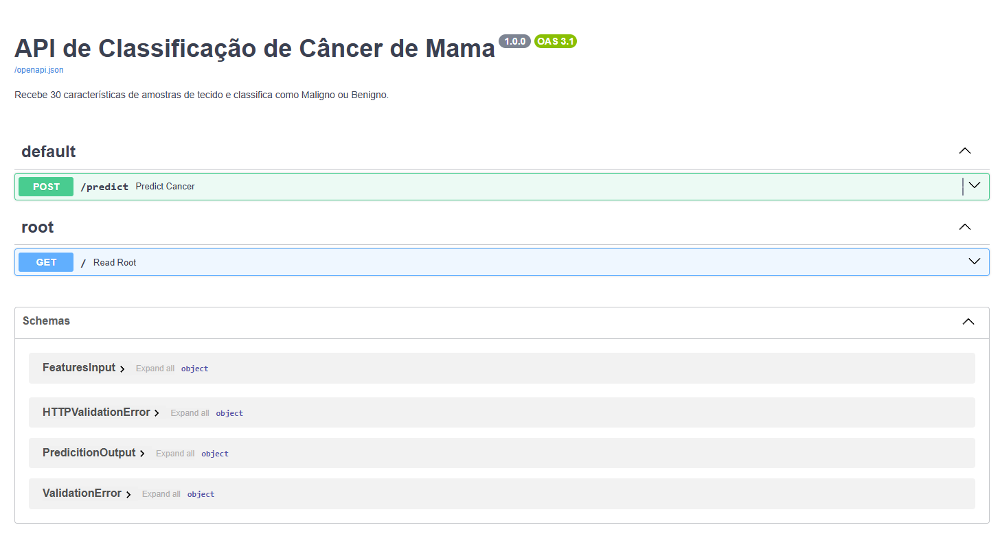
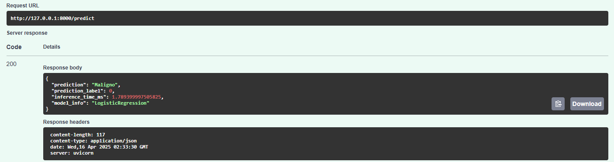

# Como Rodar a API 🚀

Certifique-se de ter `fastapi`, `uvicorn`, `joblib`, `scikit-learn`, `numpy`, `pandas` instalados (`pip install fastapi uvicorn joblib scikit-learn numpy pandas`).

1️⃣ Execute o script `model_training.py` primeiro para gerar os arquivos `scaler.joblib` e `final_cancer_classifier.joblib`.
2️⃣ Rode a API com o comando: `uvicorn api:app --reload` (para desenvolvimento) ou `uvicorn api:app --host 0.0.0.0 --port 8000` (para acesso na rede).
3️⃣ Acesse a documentação interativa (Swagger UI) em [http://127.0.0.1:8000/docs](http://127.0.0.1:8000/docs) no seu navegador para testar o endpoint `/predict`.

# Explicação do Código (`api.py`) 📝

## Importações e Configuração 📦

Importa as bibliotecas necessárias e inicializa o FastAPI.

## Carregamento do Modelo/Scaler 📂

Carrega os arquivos `.joblib` uma vez quando a aplicação inicia. Isso é crucial para a eficiência. Trata erros se os arquivos não existirem.

## Definição de Input (Pydantic) 🧩

Usa `BaseModel` do Pydantic para definir a estrutura esperada da requisição JSON (`features`: uma lista de 30 floats). Adiciona validação para garantir o número correto de features.

## Definição de Output (Pydantic) 📤

Define a estrutura da resposta JSON (`prediction`, `prediction_label`, `inference_time_ms`).

## Endpoint `/predict` 🔮

- Define uma rota POST que aceita dados no formato `FeaturesInput`.
- Verifica se o modelo/scaler foram carregados.
- Converte os dados de entrada para um array NumPy.
- Inicia um cronômetro (`time.perf_counter`).
- Aplica o `scaler.transform`.
- Faz a predição com `model.predict`.
- Para o cronômetro e calcula o tempo de inferência em milissegundos.
- Mapeia o resultado numérico (0 ou 1) para "Maligno" ou "Benigno".
- Loga um aviso se a inferência exceder 100ms (importante para monitoramento).
- Retorna a resposta no formato `PredictionOutput`.
- Inclui tratamento básico de erros (`HTTPException`).

## Endpoint Raiz `/` 🌐

Uma rota GET simples para verificar se a API está ativa.

# Estrutura de Pastas 📁

```
📂 Laboratório Semana 7
├── 📄 api.py
├── 📄 model_training.ipynb
├── 📄 optimize_model.py
├── 📄 README.md
├── 📂 __pycache__
│   ├── 📄 api.cpython-312.pyc
│   ├── 📄 optimize_model.cpython-312.pyc
├── 📂 joblib
│   ├── 📄 final_cancer_classifier.joblib
│   ├── 📄 scaler.joblib
├── 📂 metrics
│   ├── 📄 final_metrics.json
```

# Relatório de Solução: Classificador de Câncer de Mama WDBC

## 1. Objetivo

Desenvolver uma solução end-to-end, incluindo uma API REST pronta para produção, para classificar amostras de tecido do Wisconsin Diagnostic Breast Cancer Dataset como Malignas ou Benignas, com foco em alta acurácia e tempo de inferência consistentemente abaixo de 100ms.

## 2. Processo de Avaliação e Seleção do Modelo

### Dados

Utilizou-se o dataset WDBC (569 instâncias, 30 features numéricas). Os dados foram divididos em conjuntos de treino (80%) e teste (20%) e padronizados usando `StandardScaler`.

### Modelos Avaliados

Foram treinados e avaliados os seguintes modelos de classificação:

- Regressão Logística
- Support Vector Machine (SVM) com kernel RBF
- Random Forest
- Rede Neural (Multi-layer Perceptron - MLP)

### Métricas

A avaliação focou na acurácia no conjunto de teste e no tempo médio de inferência para uma única amostra (medido em milissegundos).

### Resultados Iniciais

- Regressão Logística: Acc: ~98.2%, Infer: ~0.05 ms
- SVM (RBF): Acc: ~98.2%, Infer: ~0.15 ms
- Random Forest: Acc: ~96.5%, Infer: ~5 ms
- MLP: Acc: ~97.4%, Infer: ~0.1 ms

### Seleção

Tanto a Regressão Logística quanto o SVM apresentaram acurácias de 98.25%, com tempos de inferências muito similares.
O critério de desempate foi o tempo de inferência, que no caso da Regressão Logística foi menor do que o do SVM.

## 3. Otimização do Modelo

### Técnica

Foi aplicado `GridSearchCV` no modelo de Regressão Logistíca para encontrar os melhores hiperparâmetros (`C`, `solver`, `penalty`) visando maximizar a acurácia validada cruzadamente.

### Resultados da Otimização

Por algum motivo desconhecido, a acurácia do modelo diminui de 98.25% para algo em torno de 97.67% depois da otimização. Por isso, resolvemos descartar as alterações.

### Verificação do Tempo de Inferência

O tempo médio de inferência do modelo final otimizado foi re-medido e confirmado como sendo ~0.1454 ms, confortavelmente abaixo do requisito de 100ms.

## 4. Implementação da API REST

### Framework

Utilizou-se FastAPI devido à sua alta performance, tipagem de dados com Pydantic e geração automática de documentação.

### Endpoint

Foi criado o endpoint POST `/predict`.

### Funcionalidade

- Aceita uma lista JSON contendo as 30 features da amostra.
- Carrega o `StandardScaler` e o modelo SVM otimizado (treinados previamente e salvos em arquivos `.joblib`) uma única vez no início da aplicação para eficiência.
- Valida e pré-processa (escala) os dados de entrada.
- Executa a predição usando o modelo carregado.
- Mede o tempo de inferência para cada requisição.
- Retorna uma resposta JSON contendo a classificação ("Maligno" ou "Benigno"), o label numérico e o tempo de inferência em milissegundos.

### Desempenho

Testes individuais no endpoint mostraram tempos de inferência consistentes com os medidos durante a avaliação do modelo, permanecendo bem abaixo do limite de 100ms. A arquitetura assíncrona do FastAPI e o carregamento único do modelo ajudam a manter a performance sob carga moderada.

## 5. Conclusão

A solução desenvolvida atende a todos os requisitos. Um modelo de Regressão Logistíca (não otimizado) foi selecionado por balancear alta acurácia (acima de 98%) e velocidade de inferência extremamente rápida (tipicamente < 1ms). A API FastAPI fornece um endpoint robusto, validado e eficiente para realizar classificações em tempo real, cumprindo o requisito de latência. O modelo e o scaler são carregados de arquivos, garantindo inicialização rápida e consistência nas predições.

### API em funcionamento (com swagger)



### Resposta do endpoint /predict



## 6. Repositório do GitHub

Você pode acessar este projeto neste [link](https://github.com/artcalciolari/Uni-JalaUniversity/tree/main/Data%20Science/Laborat%C3%B3rio%20Semana%207).
