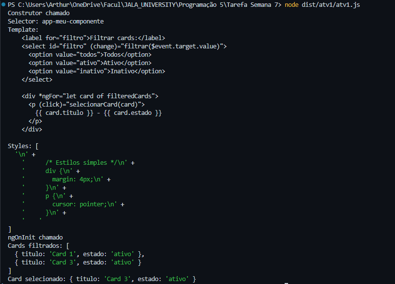
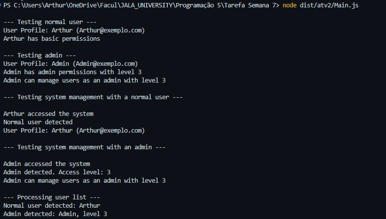

# Tarefa Semana 7

## Descrição dos Códigos

### atv1/atv1.ts

Este código simula o comportamento de um componente Angular utilizando TypeScript. Ele implementa:

* **Decorators:** Simula os decorators `@Component` e `@Output` do Angular.
* **Componente:** Define um componente chamado `MeuComponente` que exibe uma lista de cards e permite filtrá-los por estado (ativo/inativo).
* **Data Binding:** Simula o data binding com o template do componente.
* **Ciclo de Vida:** Simula os hooks de ciclo de vida do Angular (`ngOnInit`, `ngOnChanges`, etc.).
* **RxJS:** Utiliza `Subject` e `Observable` para simular a emissão de eventos através do `@Output`.

O componente exibe uma lista de cards, cada um com um título e um estado. Um select permite filtrar os cards exibidos com base no estado. Ao clicar em um card, um evento é emitido através do `@Output`.

### atv2/

Esta pasta contém três arquivos que demonstram conceitos avançados de TypeScript, como type guards, type narrowing e conditional types.

* **User.ts:** Define a classe `User` com propriedades como `id`, `name` e `email`, e métodos como `checkProfile` e `checkPermissions`.
* **Admin.ts:** Define a classe `Admin` que herda de `User` e adiciona a propriedade `authorizationLevel` e o método `manageUsers`. Sobrescreve o método `checkPermissions`.
* **Main.ts:** Contém a lógica principal que utiliza as classes `User` e `Admin` para demonstrar os seguintes conceitos:
  * **Type Guards:** A função `isAdmin` é um type guard que verifica se um usuário é um administrador.
  * **Type Narrowing:** A função `manageSystem` utiliza type narrowing para executar métodos específicos da classe `Admin` quando o usuário é um administrador.
  * **Conditional Types:** O tipo `UserType` é um conditional type que retorna `Admin` ou `User` dependendo de um parâmetro booleano. A função `createUser` utiliza este tipo para criar instâncias de `User` ou `Admin` com base no parâmetro `isAdmin`.

## Outputs

### atv1/atv1.ts

Construtor chamado

```ts
Selector: app-meu-componente 
Template:`
  <label for="filtro">Filtrar cards:</label> 
    <select id="filtro" (change)="filtrar($event.target.value)"> 
      <option value="todos">Todos</option> 
      <option value="ativo">Ativo</option> 
      <option value="inativo">Inativo</option> 
    </select>

    <div *ngFor="let card of filteredCards">
      <p (click)="selecionarCard(card)">
        {{ card.titulo }} - {{ card.estado }}
      </p>
    </div>
  `,
  styles: [
    `
      /* Estilos simples */
      div {
        margin: 4px;
      }
      p {
        cursor: pointer;
      }
    `,
  ],
```

Console:


### atv2/Main.ts

--- Testing normal user --- 
User Profile: Arthur (Arthur@exemplo.com) 
Arthur has basic permissions

--- Testing admin --- 
User Profile: Admin (Admin@exemplo.com) 
Admin has admin permissions with level 3 Admin can manage users as an admin with level 3

--- Testing system management with a normal user ---

Arthur accessed the system Normal user detected User Profile: Arthur (Arthur@exemplo.com)

--- Testing system management with an admin ---

Admin accessed the system Admin detected. Access level: 3 Admin can manage users as an admin with level 3

--- Processing user list --- 
Normal user detected: Arthur 
Admin detected: Admin, level 3

Console:
