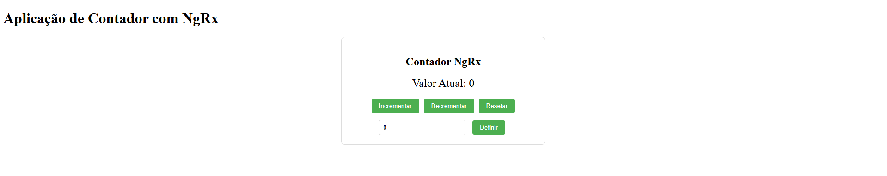

# CounterNgrx

This project was generated with [Angular CLI](https://github.com/angular/angular-cli) version 16.2.16.

## Description

This project demonstrates a counter application built with Angular and NgRx for state management. It includes features such as incrementing, decrementing, and resetting the counter value.

## Development server

Run `ng serve` for a dev server. Navigate to `http://localhost:4200/`. The application will automatically reload if you change any of the source files.

## NgRx Store

The application uses NgRx for state management. Key components include:

- **State:** Defines the structure of the counter state ([`CounterState`](src/app/store/counter/counter.state.ts)).
- **Reducers:** Handles state transitions based on dispatched actions ([`counterReducer`](src/app/store/counter/counter.reducer.ts)).
- **Actions:** Defines the actions that can be dispatched to update the state ([`CounterActions`](src/app/store/counter/counter.actions.ts)).
- **Effects:** Manages side effects, such as asynchronous operations ([`CounterEffects`](src/app/store/counter/counter.effects.ts)).
- **Selectors:** Used for querying the state ([`CounterSelectors`](src/app/store/counter/counter.selectors.ts)).

## Final Result

