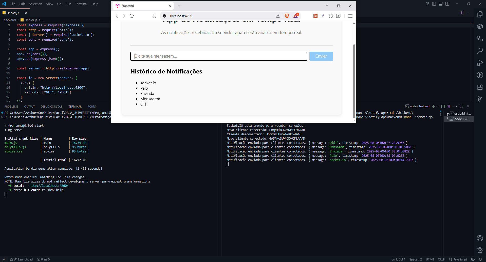

# Notify App

## Estrutura e Arquitetura

O projeto está dividido em duas partes principais: `backend` e `frontend`.

- **backend/**: Contém a API Node.js responsável por gerenciar as conexões WebSocket (utilizando Socket.IO) e fornecer endpoints para o frontend. O arquivo principal é o `server.js` e as dependências estão listadas no `package.json`.
- **frontend/**: Aplicação Angular responsável pela interface do usuário. Os arquivos de configuração (`angular.json`, `tsconfig.json`, etc.) e o código-fonte estão organizados em `src/`, com a lógica principal em `app/` e serviços em `app/services/`.



## Instruções de Execução

### Backend

1. Acesse a pasta `backend`:

   ```powershell
   cd backend
   ```

2. Instale as dependências:

   ```powershell
   npm install
   ```

3. Inicie o servidor:

   ```powershell
   node server.js
   ```

   O backend estará disponível na porta configurada (por padrão, 3000).

### Frontend

1. Acesse a pasta `frontend`:

   ```powershell
   cd frontend
   ```

2. Instale as dependências:

   ```powershell
   npm install
   ```

3. Inicie o servidor de desenvolvimento Angular:

   ```powershell
   npm start
   ```

   O frontend estará disponível em `http://localhost:4200`.

## Reflexão Técnica

### Diferenças entre WebSockets e HTTP

HTTP é um protocolo baseado em requisições e respostas, onde cada interação é independente e não há um canal persistente entre cliente e servidor. Isso limita a comunicação em tempo real, pois o servidor só pode responder após uma requisição do cliente. WebSockets, por sua vez, estabelecem um canal bidirecional e persistente, permitindo que tanto cliente quanto servidor enviem mensagens a qualquer momento, sem a necessidade de novas requisições. Isso é fundamental para aplicações que exigem atualização em tempo real, como chats e notificações instantâneas.

### Desafios de Escalabilidade com WebSockets

WebSockets exigem que o servidor mantenha o estado de cada conexão ativa, consumindo mais recursos do que conexões HTTP tradicionais. Em ambientes de alta demanda, isso pode sobrecarregar o servidor rapidamente. Além disso, balanceadores de carga convencionais podem não lidar bem com conexões persistentes, exigindo soluções específicas para WebSockets. Outro desafio é a sincronização de estado entre múltiplos servidores, garantindo que mensagens sejam entregues corretamente a todos os clientes, independentemente do nó ao qual estão conectados.

### Vantagens do Socket.IO em Comparação com WebSockets Puros

Socket.IO é uma biblioteca que abstrai e estende o protocolo WebSocket, oferecendo recursos adicionais como fallbacks automáticos (utilizando long polling quando WebSockets não estão disponíveis), reconexão automática, suporte a salas e broadcast, transporte de eventos nomeados e compatibilidade cross-browser. Essas funcionalidades tornam o desenvolvimento de aplicações em tempo real mais simples, robusto e escalável, especialmente em cenários complexos ou de grande escala, onde WebSockets puros exigiriam muito mais código e infraestrutura para lidar com todos esses desafios.
