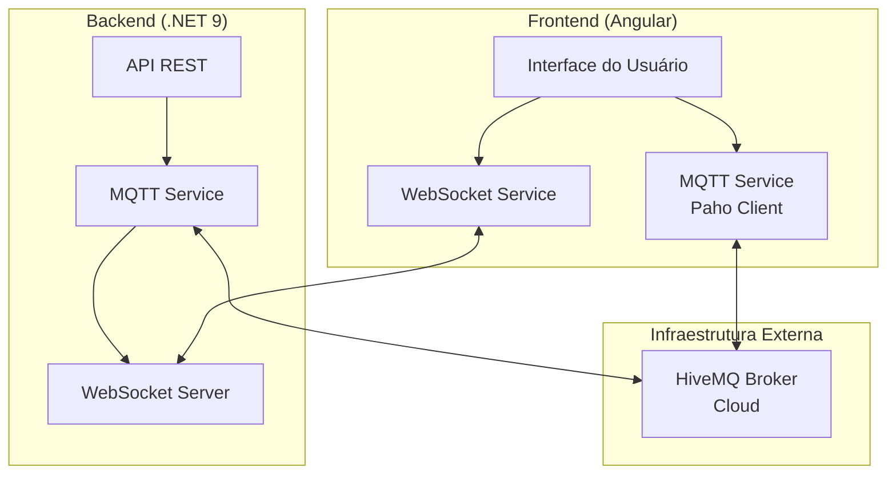
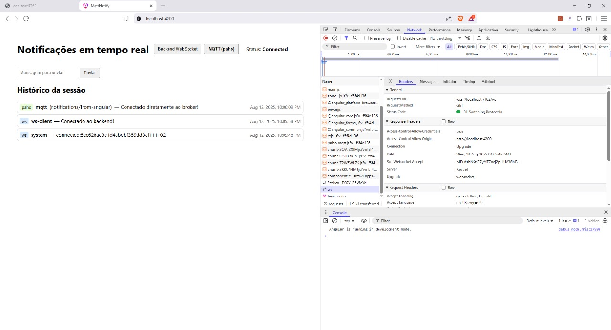

# Sistema de Notificações MQTT + WebSockets

Um sistema híbrido de notificações em tempo real que combina MQTT para mensageria distribuída e WebSockets para comunicação cliente-servidor direta.

## 📋 Índice

- [Estrutura e Arquitetura](#️-estrutura-e-arquitetura)
- [Instruções de Execução](#-instruções-de-execução)
- [Reflexão Técnica](#-reflexão-técnica)

## 🏗️ Estrutura e Arquitetura

### Visão Geral

O projeto consiste em dois componentes principais:

```text
├── mqtt-notify/           # Frontend Angular
│   ├── src/app/
│   │   ├── services/
│   │   │   ├── mqtt.service.ts     # Cliente MQTT (Paho)
│   │   │   └── ws.service.ts       # Cliente WebSocket
│   │   └── models/
│   │       └── notification.ts     # Interface de notificação
│   └── package.json
│
└── MqttWsServer/         # Backend .NET 9
    ├── Program.cs                  # Configuração e endpoints
    ├── MqttService.cs             # Serviço MQTT cliente
    ├── WebSocketConnectionManager.cs  # Gerenciador WS
    └── appsettings.json           # Configurações
```

### Arquitetura do Sistema



](img.jpg)

### Componentes Principais

#### Backend (.NET 9)

1. **Program.cs**: Ponto de entrada da aplicação
   - Configura CORS para permitir requisições do frontend
   - Registra serviços (WebSocket Manager, MQTT Service)
   - Define endpoints REST e WebSocket

2. **MqttService.cs**: Gerencia conexão MQTT
   - Cliente MQTT usando MQTTnet library
   - Subscreve tópicos configurados
   - Publica mensagens quando solicitado via API
   - Retransmite mensagens MQTT recebidas via WebSocket

3. **WebSocketConnectionManager.cs**: Gerencia conexões WebSocket
   - Mantém lista ativa de conexões
   - Broadcast de mensagens para todos os clientes conectados
   - Tratamento de conexões/desconexões

#### Frontend (Angular)

1. **mqtt.service.ts**: Cliente MQTT direto
   - Usa biblioteca Paho-MQTT
   - Conecta diretamente ao broker HiveMQ
   - Subscreve tópicos e recebe mensagens

2. **ws.service.ts**: Cliente WebSocket
   - Conecta ao backend via WebSocket
   - Recebe notificações do servidor
   - Auto-reconexão em caso de falha

3. **notification.ts**: Modelo de dados unificado
   - Interface comum para mensagens MQTT e WebSocket

### Fluxo de Dados

1. **Mensagens MQTT → WebSocket**:
   - Broker MQTT → Backend MQTT Service → WebSocket Manager → Frontend

2. **API REST → MQTT**:
   - Frontend/Cliente → Backend API → MQTT Service → Broker MQTT

3. **WebSocket Direto**:
   - Frontend → Backend WebSocket → Todos os clientes conectados

## 🚀 Instruções de Execução

### Pré-requisitos

- **.NET 9 SDK** - [Download](https://dotnet.microsoft.com/download/dotnet/9.0)
- **Node.js 18+** - [Download](https://nodejs.org/)
- **Angular CLI** - `npm install -g @angular/cli`

### Executando o Backend

1. **Navegue para o diretório do backend**:

   ```powershell
   cd MqttWsServer
   ```

2. **Restaure as dependências**:

   ```powershell
   dotnet restore
   ```

3. **Configure as credenciais MQTT** (opcional):
   - Edite `appsettings.json` com suas credenciais do HiveMQ ou outro broker
   - As configurações atuais apontam para um broker HiveMQ Cloud de teste

4. **Execute a aplicação**:

   ```powershell
   dotnet run
   ```

5. **Verificação**:
   - Backend estará rodando em `http://localhost:5000` ou `https://localhost:5001`
   - Endpoint de status: `GET /` retorna "MQTT+WS server running."
   - WebSocket disponível em: `ws://localhost:5000/ws`

### Executando o Frontend

1. **Navegue para o diretório do frontend**:

   ```powershell
   cd mqtt-notify
   ```

2. **Instale as dependências**:

   ```powershell
   npm install
   ```

3. **Execute a aplicação em modo de desenvolvimento**:

   ```powershell
   npm start
   ```

4. **Acesse a aplicação**:
   - Frontend estará disponível em `http://localhost:4200`
   - A aplicação conectará automaticamente aos serviços MQTT e WebSocket

### Testando o Sistema

1. **Teste de Conectividade**:
   - Abra a aplicação frontend
   - Verifique se os status de MQTT e WebSocket mostram "connected"

2. **Teste de Mensagens**:
   - Use a interface para enviar mensagens
   - Mensagens aparecerão em tempo real
   - Abra múltiplas abas para testar broadcast

3. **Teste via API REST**:

   ```powershell
   # Enviar notificação via API
   Invoke-RestMethod -Uri "http://localhost:5000/api/notify" -Method POST -Body '{"topic":"test/topic","text":"Mensagem de teste"}' -ContentType "application/json"
   ```

## 💭 Reflexão Técnica

### Diferenças entre MQTT e WebSockets

**WebSockets** são uma tecnologia de comunicação bidirecional em tempo real entre cliente e servidor, criando um canal persistente sobre HTTP. É ideal para aplicações que necessitam de comunicação direta e imediata entre um cliente específico e o servidor, como chats ou atualizações de interface em tempo real.

**MQTT** (Message Queuing Telemetry Transport) é um protocolo de mensageria leve baseado no padrão publish/subscribe, projetado especificamente para ambientes com recursos limitados e redes instáveis. Ao contrário dos WebSockets, que estabelecem conexões ponto-a-ponto, o MQTT utiliza um broker central que atua como intermediário, permitindo desacoplamento completo entre produtores e consumidores de mensagens.

A principal diferença conceitual reside na abordagem: WebSockets focam na **conexão direta** entre duas entidades, enquanto MQTT prioriza a **distribuição eficiente de mensagens** através de tópicos hierárquicos. No WebSocket, se o servidor falhar, todas as conexões são perdidas; no MQTT, o broker pode implementar persistência de sessão e entrega garantida de mensagens.

### Como MQTT Resolve Problemas de Escalabilidade e Performance

**Escalabilidade**: O MQTT resolve problemas de escalabilidade através de sua arquitetura distribuída. O broker centraliza o roteamento de mensagens, eliminando a necessidade de cada cliente manter conexões com todos os outros participantes. Isso reduz drasticamente o número de conexões necessárias - em vez de N×(N-1) conexões em uma topologia completamente conectada, temos apenas N conexões cliente-broker. Brokers MQTT podem ser clusterizados e distribuídos geograficamente, permitindo escalabilidade horizontal quase ilimitada.

**Performance**: O protocolo MQTT é extremamente otimizado para largura de banda limitada. Seu cabeçalho mínimo de apenas 2 bytes, comparado aos cabeçalhos HTTP substancialmente maiores dos WebSockets, resulta em menor overhead de rede. O sistema de QoS (Quality of Service) oferece três níveis de garantia de entrega (0, 1, 2), permitindo ajustar o trade-off entre performance e confiabilidade conforme necessário.

**Eficiência de Recursos**: O padrão publish/subscribe elimina polling desnecessário e reduz o tráfego de rede. Clientes só recebem mensagens de tópicos aos quais estão subscritos, filtrando naturalmente informações irrelevantes. A funcionalidade de "retain" permite que mensagens importantes sejam preservadas para novos subscribers, reduzindo a necessidade de sincronização complexa.

**Resiliência**: MQTT implementa mecanismos robustos de reconexão automática e keep-alive, fundamentais para dispositivos IoT e redes instáveis. O conceito de "last will and testament" permite notificações automáticas de desconexões inesperadas, crucial para sistemas críticos de monitoramento.
